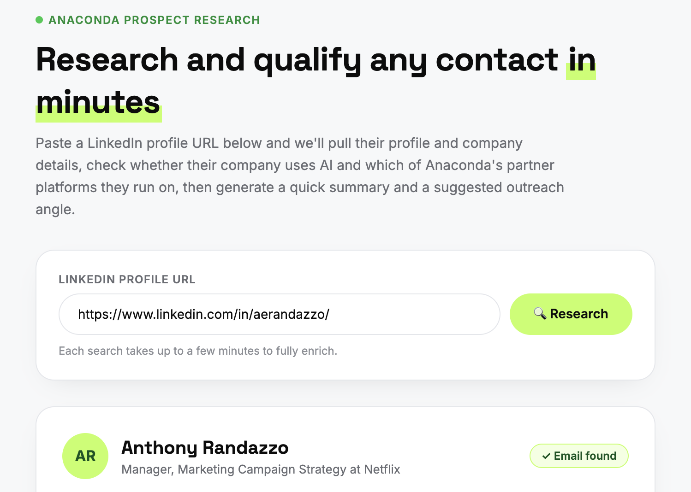
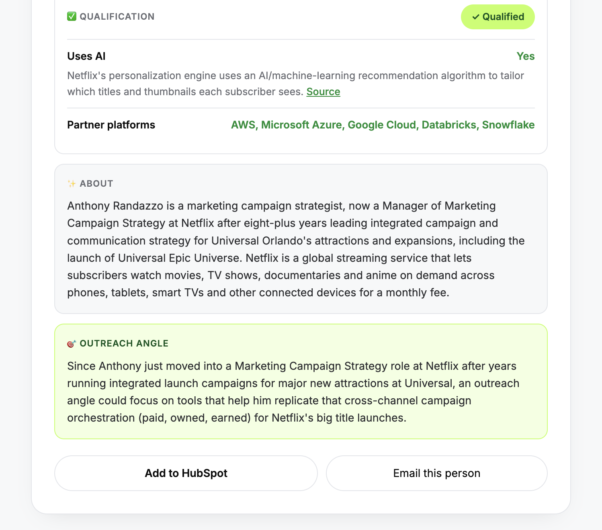

# Anaconda Prospect Research Agent

Paste a LinkedIn URL. Get the prospect's profile, verified work email, an AI-written summary and outreach angle, and a clear verdict on whether their company is a good fit for Anaconda. Then save it all to HubSpot in one click.

Paste a LinkedIn profile URL and hit Research:

The result card shows the qualification verdict with its evidence, a short summary and an outreach angle:

## The problem

Imagine you're scrolling LinkedIn and a profile catches your eye. To know if that person is worth reaching out to, you'd normally have to enrich the lead, find their email, read up on their company, work out what it does, and check whether it uses AI and which platforms it runs on. That means jumping from one tool to the next for every single prospect.
With this app, you just paste the LinkedIn profile URL. It does all of that for you and comes back with one clear answer

## What it does

One search returns:

- **Who they are:** name, title, company, location and verified work email.
- **About:** two or three sentences on who the person is, what they do and what their company does, written from their profile and the company's own website.
- **Outreach angle:** one specific angle based on their real background.
- **Qualification verdict:** Qualified, Not qualified, or Incomplete, with the evidence behind it.

## How qualification works

A company is **qualified** when both checks pass:

1. **Does the company use AI?** Claude reads the company's website, including AI pages like /ai or /copilot, and searches the web if the site doesn't settle it. It returns yes or no, with the evidence and a source link.
2. **Does it run on an Anaconda partner platform?** AWS, Microsoft Azure, Google Cloud, Oracle Cloud, Databricks or Snowflake. A custom Clay workflow checks two places:
   - **The website's tech stack** (BuiltWith), which catches cloud hosting.
   - **Job posts from the last year** (TheirStack), which is where data tools like Snowflake and Databricks usually show up. The card links to the job post as proof.

If a check can't run, the verdict says **Incomplete** instead of guessing.

## How it works

1. **Enrich the person** with Clay ("Enrich Person").
2. **Run three checks at the same time:** work email (Clay "Work Email"), the tech stack check (custom Clay workflow), and a read of the company website.
3. **One Claude call** writes the About and outreach angle and answers the AI question, using web search only when needed.
4. **Score the verdict** and show everything on one card.
5. **Add to HubSpot** creates or updates the contact by email and attaches the research as a note.

## Built to hold up

- **Fits inside the hosting time limit.** Every step shares one time budget, so a slow lookup can't make the whole search fail. A full search took about 40 seconds in testing.
- **Lean on credits.** Uses Clay's single-purpose routines instead of a bundled one that also ran an unused phone search, which was slower and over four times the cost.
- **Fails clearly.** Rate limits are retried, and a missing check shows as Incomplete rather than a wrong answer.

## Stack

Python · Flask · Clay (Public API, managed routines and a custom workflow) · BuiltWith · TheirStack · Claude API with web search · HubSpot API · Vercel
